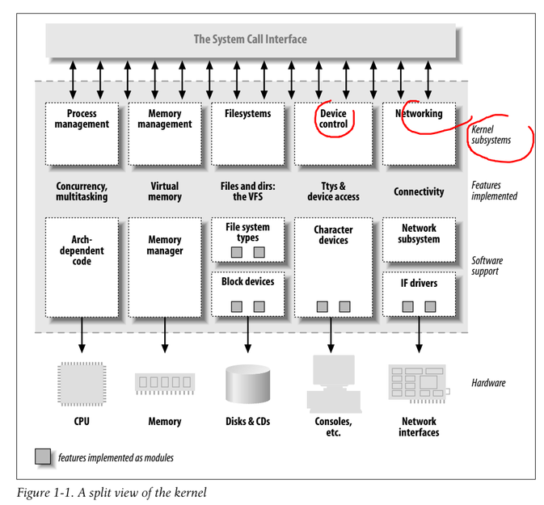

# Chapter 1: An introduction to device drivers
Device drivers are distinct "black boxes" that make a particular piece of hardware respond to a well-defined internal programming interface, they hide completely the details of how the device works. User activities are performed by means of a set of standardized calls that are independent of the specific driver; mapping those calls to device-specific operations that act on real hardware is then the role of the device driver.  

**The role of device driver**  
When writing drivers, a programmer should pay particular attention to the fundamental concept; write kernel code to access the hardware, but don't force particular policies on the user, since different users have different needs. 

**Spitting the kernel**  
Tasks performed by the kernel:
- Process management
- Memory management
- Filesystems
- Device control
- Networking

**Loadable modules**  
Each piece of code that can be added to the kernel at runtime is called a module. The Linux kernel offers support for quite a few different types (or classes) of modules, including, but not limited to, device drivers. Each module is made up of object code (not linked into a complete executable) that can be dynamically linked to the running kernel by the insmod program and can be unlinked by the rmmod program.

<figure align="center">
    
</figure>

**Classes of devices and modules**  
Three classes of modules:
- Character devices: A character (char) device is one that can be accessed as a stream of bytes (like a file); a char driver is in charge of implementing this behavior. Such a driver usually implements at least the open, close, read, and write system calls. The text console (/dev/console) and the serial ports (/dev/ttyS0 and friends) are examples of char devices, as they are well represented by the stream abstraction. Char devices are accessed by means of filesystem nodes, such as /dev/tty1 and /dev/lp0. The only relevant difference between a char device and a regular file is that you can always move back and forth in the regular file, whereas most char devices are just data channels, which you can only access sequentially. There exist, nonetheless, char devices that look like data areas, and you can move back and forth in them; for instance, this usually applies to frame grabbers, where the applications can access the whole acquired image using mmap or lseek.
- Block devices: Like char devices, block devices are accessed by filesystem nodes in the /dev directory. A block device is a device (e.g., a disk) that can host a filesystem. In most Unix systems, a block device can only handle I/O operations that transfer one or more whole blocks, which are usually 512 bytes (or a larger power of two) bytes in length. Linux, instead, allows the application to read and write a block device like a char device—it permits the transfer of any number of bytes at a time. As a result, block and char devices differ only in the way data is managed internally by the kernel, and thus in the kernel/driver software interface. Like a char device, each block device is accessed through a filesystem node, and the difference between them is transparent to the user. Block drivers have a completely different interface to the kernel than char drivers.
- Network interfaces: Any network transaction is made through an interface, that is, a device that is able to exchange data with other hosts. Usually, an interface is a hardware device, but it might also be a pure software device, like the loopback interface. A network interface is in charge of sending and receiving data packets, driven by the network subsystem of the kernel, without knowing how individual transac- tions map to the actual packets being transmitted. Many network connections (especially those using TCP) are stream-oriented, but network devices are, usually, designed around the transmission and receipt of packets. A network driver knows nothing about individual connections; it only handles packets. Not being a stream-oriented device, a network interface isn’t easily mapped to a node in the filesystem, as /dev/tty1 is. The Unix way to provide access to inter- faces is still by assigning a unique name to them (such as eth0), but that name doesn’t have a corresponding entry in the filesystem. Communication between the kernel and a network device driver is completely different from that used with char and block drivers. Instead of read and write, the kernel calls functions related to packet transmission.

**Security issues**  
As a device driver writer, you should be aware of situations in which some types of device access could adversely affect the system as a whole and should provide ade- quate controls. For example, device operations that affect global resources (such as setting an interrupt line), which could damage the hardware (loading firmware, for example), or that could affect other users (such as setting a default block size on a tape drive), are usually only available to sufficiently privileged users, and this check must be made in the driver itself.  

Driver writers must also be careful, of course, to avoid introducing security bugs. The C programming language makes it easy to make several types of errors. Many current security problems are created, for example, by buffer overrun errors, in which the programmer forgets to check how much data is written to a buffer, and data ends up written beyond the end of the buffer, thus overwriting unrelated data. Such errors can compromise the entire system and must be avoided. Fortunately, avoiding these errors is usually relatively easy in the device driver context, in which the interface to the user is narrowly defined and highly controlled.

Some other general security ideas are worth keeping in mind. Any input received from user processes should be treated with great suspicion; never trust it unless you can verify it. Be careful with uninitialized memory; any memory obtained from the kernel should be zeroed or otherwise initialized before being made available to a user process or device. Otherwise, information leakage (disclosure of data, passwords, etc.) could result. If your device interprets data sent to it, be sure the user cannot send anything that could compromise the system. Finally, think about the possible effect of device operations; if there are specific operations (e.g., reloading the firmware on an adapter board or formatting a disk) that could affect the system, those operations should almost certainly be restricted to privileged users.

Be careful, also, when receiving software from third parties, especially when the kernel is concerned: because everybody has access to the source code, everybody can break and recompile things. Although you can usually trust precompiled kernels found in your distribution, you should avoid running kernels compiled by an untrusted friend—if you wouldn’t run a precompiled binary as root, then you’d better not run a precompiled kernel. For example, a maliciously modified kernel could allow anyone to load a module, thus opening an unexpected back door via init_module.

**Version numbering**  

**License terms**  

