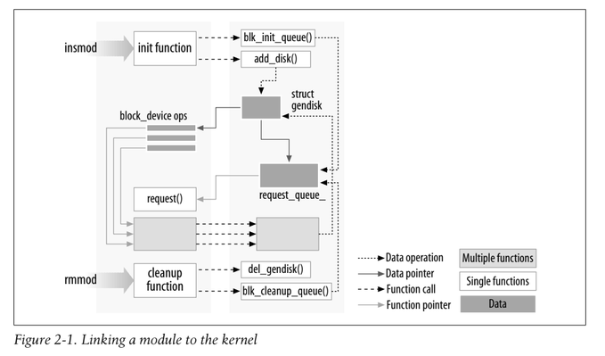

# Chapter 2: Building and running modules

**The hello world module**  
```
#include <linux/init.h>
#include <linux/module.h>
MODULE_LICENSE("Dual BSD/GPL");

static int hello_init(void)
{
    printk(KERN_ALERT "Hello, world\n");
    return 0;
}

static void hello_exit(void)
{
    printk(KERN_ALERT "Goodbye, cruel world\n");
}

module_init(hello_init);
module_exit(hello_exit);
```
This module defines two functions, one to be invoked when the module is loaded into the kernel (hello_init)and one for when the module is removed (hello_exit). The module_init and module_exit lines use special kernel macros to indicate the role of these two functions. Another special macro (MODULE_LICENSE)is used to tell the kernel that this module bears a free license; without such a declaration, the kernel complains when the module is loaded.

You can test the module with the insmod and rmmod utilities, as shown below. Note
that only the superuser can load and unload a module.
```
% make
make[1]: Entering directory `/usr/src/linux-2.6.10'
    CC [M] /home/ldd3/src/misc-modules/hello.o
    Building modules, stage 2.
    MODPOST
    CC /home/ldd3/src/misc-modules/hello.mod.o
    LD [M] /home/ldd3/src/misc-modules/hello.ko
make[1]: Leaving directory `/usr/src/linux-2.6.10'

% su
root# insmod ./hello.ko
Hello, world
root# rmmod hello
Goodbye cruel world
root#
```

**Kernel modules versus applications**  
While most small and medium-sized applications perform a single task from beginning to end, every kernel module just registers itself in order to serve future requests, and its initialization function terminates immediately. In other words, the task of the module’s initialization function is to prepare for later invocation of the module’s functions; it’s as though the module were saying, “Here I am, and this is what I can do.” The module’s exit function (hello_exit in the example)gets invoked just before the module is unloaded. While most small and medium-sized applications perform a single task from beginning to end, every kernel module just registers itself in order to serve future requests, and its initialization function terminates immediately. In other words, the task of the module’s initialization function is to prepare for later invocation of the module’s functions; it’s as though the module were saying, “Here I am, and this is what I can do.” The module’s exit function (hello_exit in the example)gets invoked just before the module is unloaded.

As a programmer, you know that an application can call functions it doesn’t define: the linking stage resolves external references using the appropriate library of functions. printf is one of those callable functions and is defined in libc. A module, on the other hand, is linked only to the kernel, and the only functions it can call are the ones exported by the kernel; there are no libraries to link to. The printk function used in hello.c earlier, for example, is the version of printf defined within the kernel and exported to modules. It behaves similarly to the original function, with a few minor differences, the main one being lack of floating-point support.

<figure align="center">
    
</figure>

**Userspace and kernel space**   
A module runs in kernel space, whereas applications run in user space. This concept is at the base of operating systems theory.

The role of the operating system, in practice, is to provide programs with a consistent view of the computer’s hardware. In addition, the operating system must account for independent operation of programs and protection against unauthorized access to resources. This nontrivial task is possible only if the CPU enforces protection of system software from the applications.

Every modern processor is able to enforce this behavior. The chosen approach is to
implement different operating modalities (or levels)in the CPU itself. The levels have different roles, and some operations are disallowed at the lower levels; program code can switch from one level to another only through a limited number of gates. Unix systems are designed to take advantage of this hardware feature, using two such levels. All current processors have at least two protection levels, and some, like the x86 family, have more levels; when several levels exist, the highest and lowest levels are used. Under Unix, the kernel executes in the highest level (also called supervisor mode), where everything is allowed, whereas applications execute in the lowest level (the so-called user mode), where the processor regulates direct access to hardware and unauthorized access to memory.

We usually refer to the execution modes as kernel space and user space. These terms encompass not only the different privilege levels inherent in the two modes, but also the fact that each mode can have its own memory mapping—its own address space—as well.

Unix transfers execution from user space to kernel space whenever an application
issues a system call or is suspended by a hardware interrupt. Kernel code executing a system call is working in the context of a process—it operates on behalf of the calling process and is able to access data in the process’s address space. Code that handles interrupts, on the other hand, is asynchronous with respect to processes and is not related to any particular process.

**Concurrency in the Kernel**   
One way in which kernel programming differs greatly from conventional application programming is the issue of concurrency. Most applications, with the notable exception of multithreading applications, typically run sequentially, from the beginning to the end, without any need to worry about what else might be happening to change their environment. Kernel code does not run in such a simple world, and even the simplest kernel modules must be written with the idea that many things can be happening at once.

Linux kernel code, including driver code, must be reentrant—it must be capable of running in more than one context at the same time. Data structures must be carefully designed to keep multiple threads of execution separate, and the code must take care to access shared data in ways that prevent corruption of the data. Writing code that handles concurrency and avoids race conditions (situations in which an unfortunate order of execution causes undesirable behavior)requires thought and can be tricky. Proper management of concurrency is required to write correct kernel code; for that reason, every sample driver in this book has been written with concurrency in mind.

**The Current Process**  
Although kernel modules don’t execute sequentially as applications do, most actions performed by the kernel are done on behalf of a specific process. Kernel code can refer to the current process by accessing the global item current, defined in <asm/ current.h>, which yields a pointer to struct task_struct, defined by <linux/sched.h>. The current pointer refers to the process that is currently executing. During the execution of a system call, such as open or read, the current process is the one that invoked the call. Kernel code can use process-specific information by using current, if it needs to do so.
```
printk(KERN_INFO "The process is \"%s\" (pid %i)\n",
current->comm, current->pid);
```

**A Few Other Details**  
Applications are laid out in virtual memory with a very large stack area. The stack, of course, is used to hold the function call history and all automatic variables created by currently active functions. The kernel, instead, has a very small stack; it can be as small as a single, 4096-byte page. Your functions must share that stack with the entire kernel-space call chain. Thus, it is never a good idea to declare large automatic variables; if you need larger structures, you should allocate them dynamically at call time.

Often, as you look at the kernel API, you will encounter function names starting with a double underscore (__). Functions so marked are generally a low-level component of the interface and should be used with caution. Essentially, the double underscore says to the programmer: “If you call this function, be sure you know what you are doing.”

Kernel code cannot do floating point arithmetic. Enabling floating point would
require that the kernel save and restore the floating point processor’s state on each entry to, and exit from, kernel space—at least, on some architectures. Given that there really is no need for floating point in kernel code, the extra overhead is not worthwhile.

**Compiling modules**  
As the first step, we need to look a bit at how modules must be built.

Còn lại ở chương này đọc sau
