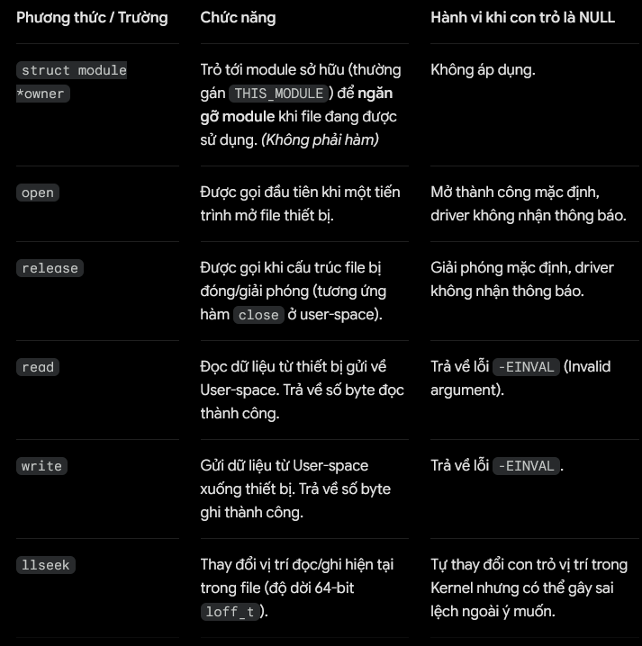
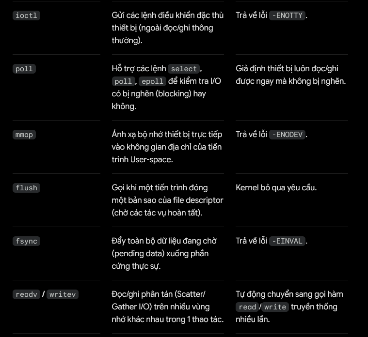
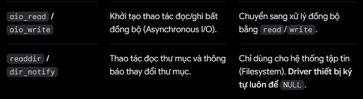
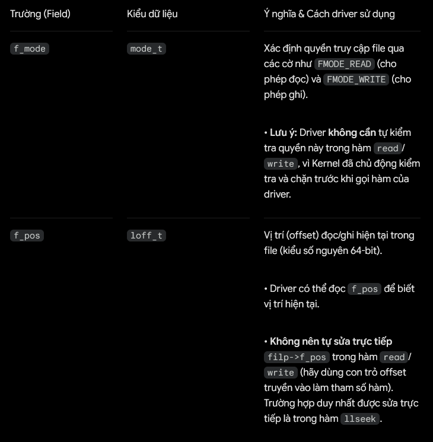
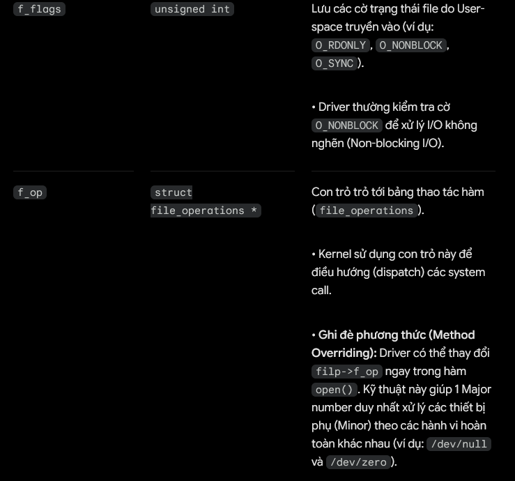
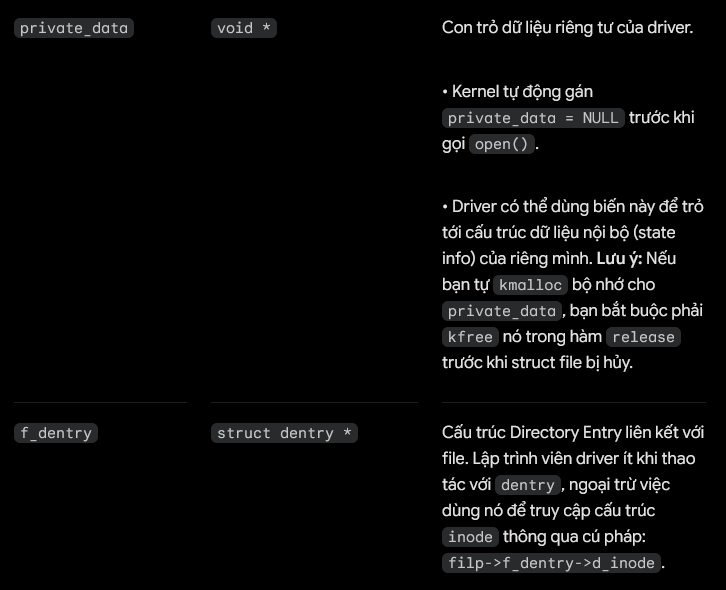
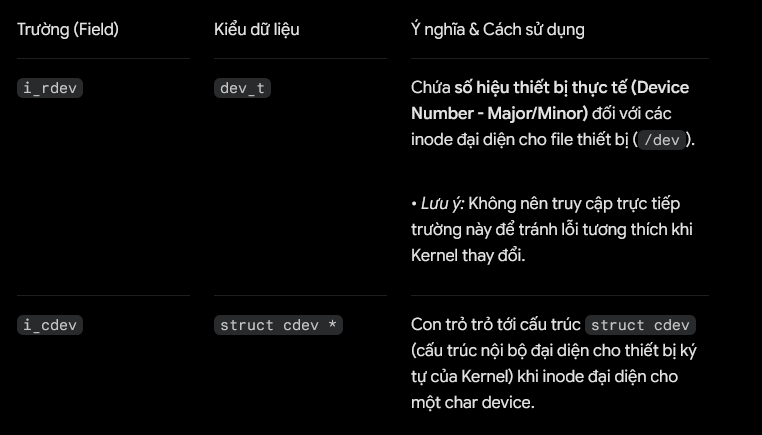

# Chapter 3: Char drivers

Throughout the chapter, we present code fragments extracted from a real device driver: scull (Simple Character Utility for Loading Localities). scull is a char driver that acts on a memory area as though it were a device. In this chapter, because of that peculiarity of scull, we use the word device interchangeably with “the memory area used by scull.”

The advantage of scull is that it isn’t hardware dependent. scull just acts on some memory, allocated from the kernel. Anyone can compile and run scull, and scull is portable across the computer architectures on which Linux runs. On the other hand, the device doesn’t do anything “useful” other than demonstrate the interface between the kernel and char drivers and allow the user to run some tests.

**The Design of scull**  
The first step of driver writing is defining the capabilities (the mechanism) the driver will offer to user programs. Since our “device” is part of the computer’s memory, we’re free to do what we want with it. It can be a sequential or random-access device, one device or many, and so on.  
The scull source implements the following devices. Each kind of device implemented
by the module is referred to as a type.
- scull0 to scull3: Four devices, each consisting of a memory area that is both global and persistent. Global means that if the device is opened multiple times, the data contained within the device is shared by all the file descriptors that opened it. Persistent means that if the device is closed and reopened, data isn’t lost. This device can be fun to work with, because it can be accessed and tested using conventional commands, such as cp, cat, and shell I/O redirection.
- scullpipe0 to scullpipe3: Four FIFO (first-in-first-out) devices, which act like pipes. One process reads what another process writes. If multiple processes read the same device, they contend for data. The internals of scullpipe will show how blocking and non- blocking read and write can be implemented without having to resort to interrupts. Although real drivers synchronize with their devices using hardware interrupts, the topic of blocking and nonblocking operations is an important one and is separate from interrupt handling (covered in Chapter 10).
- scullsingle
- scullpriv
- sculluid
- scullwuid: These devices are similar to scull0 but with some limitations on when an open is permitted. The first (scullsingle) allows only one process at a time to use the driver, whereas scullpriv is private to each virtual console (or X terminal ses-
sion), because processes on each console/terminal get different memory areas. sculluid and scullwuid can be opened multiple times, but only by one user at a time; the former returns an error of “Device Busy” if another user is locking the device, whereas the latter implements blocking open. These variations of scull would appear to be confusing policy and mechanism, but they are worth look- ing at, because some real-life devices require this sort of management.

**Major and minor numbers**  
Char devices are accessed through names in the filesystem. Those names are called special files or device files or simply nodes of the filesystem tree; they are conventionally located in the /dev directory. Special files for char drivers are identified by a “c” in the first column of the output of ls –l. Block devices appear in /dev as well, but they are identified by a “b.” The focus of this chapter is on char devices, but much of the following information applies to block devices as well.

If you issue the ls –l command, you’ll see two numbers (separated by a comma) in the device file entries before the date of the last modification, where the file length normally appears. These numbers are the major and minor device number for the particular device. The following listing shows a few devices as they appear on a typical system. Their major numbers are 1, 4, 7, and 10, while the minors are 1, 3, 5, 64, 65, and 129.
```
crw-rw-rw- 1 root root 1, 3 Apr 11 2002 null
crw------- 1 root root 10, 1 Apr 11 2002 psaux
crw------- 1 root root 4, 1 Oct 28 03:04 tty1
crw-rw-rw- 1 root tty 4, 64 Apr 11 2002 ttys0
crw-rw---- 1 root uucp 4, 65 Apr 11 2002 ttyS1
crw--w---- 1 vcsa tty 7, 1 Apr 11 2002 vcs1
crw--w---- 1 vcsa tty 7, 129 Apr 11 2002 vcsa1
crw-rw-rw- 1 root root 1, 5 Apr 11 2002 zero
```
Traditionally, the major number identifies the driver associated with the device. For example, /dev/null and /dev/zero are both managed by driver 1, whereas virtual con- soles and serial terminals are managed by driver 4; similarly, both vcs1 and vcsa1 devices are managed by driver 7. Modern Linux kernels allow multiple drivers to share major numbers, but most devices that you will see are still organized on the one-major-one-driver principle. 

Major number xác định driver chịu trách nhiệm quản lý thiết bị.

The minor number is used by the kernel to determine exactly which device is being referred to. Depending on how your driver is written (as we will see below), you can either get a direct pointer to your device from the kernel, or you can use the minor number yourself as an index into a local array of devices. Either way, the kernel itself knows almost nothing about minor numbers beyond the fact that they refer to devices implemented by your driver.

Minor number xác định thiết bị cụ thể hoặc kênh cụ thể do driver đó quản lý (ví dụ: một driver quản lý 4 cổng nối tiếp thì có 1 Major number và 4 Minor number từ 0 đến 3).

**The Internal Representation of Device Numbers**  
Within the kernel, the dev_t type (defined in <linux/types.h>) is used to hold device numbers—both the major and minor parts. As of Version 2.6.0 of the kernel, dev_t is a 32-bit quantity with 12 bits set aside for the major number and 20 for the minor number. Your code should, of course, never make any assumptions about the internal organization of device numbers; it should, instead, make use of a set of macros found in <linux/kdev_t.h>. To obtain the major or minor parts of a dev_t, use:
```
MAJOR(dev_t dev);
MINOR(dev_t dev);
```

If, instead, you have the major and minor numbers and need to turn them into a dev_t,use:
```
MKDEV(int major, int minor);
```

**Allocating and Freeing Device Numbers**  

**Phương pháp 1: Cấp phát Tĩnh (Static Allocation) — register_chrdev_region**  

Dùng khi bạn đã biết chính xác số Major Number nào mình muốn xin.
```
int register_chrdev_region(dev_t first, unsigned int count, char *name);
```
Tham số:
```
first: Số hiệu thiết bị bắt đầu xin cấp (chứa cả Major và Minor mong muốn, dùng macro MKDEV(major, minor) để tạo). Thường minor bắt đầu từ 0.

count: Số lượng Minor number liên tiếp muốn xin.

name: Tên của thiết bị. Tên này sẽ xuất hiện trong tập tin /proc/devices và hệ thống /sys.
```
Trả về: 0 nếu thành công; trả về số âm (mã lỗi như -EBUSY) nếu dải số đó đã bị driver khác chiếm mất.

Hạn chế: Dễ gây xung đột (conflict) nếu dải số bạn chọn trùng với một driver đã nạp trước đó trong hệ thống.

**Phương pháp 2: Cấp phát Động (Dynamic Allocation) — alloc_chrdev_region (Khuyên dùng)**

Dùng khi bạn chưa có Major Number và muốn Kernel tự động tìm và cấp cho bạn một Major Number còn trống. Đây là phương pháp chuẩn và an toàn nhất trong lập trình Linux Kernel hiện đại.
```
int alloc_chrdev_region(dev_t *dev, unsigned int firstminor, unsigned int count, char *name);
```
Tham số:
```
dev: Tham số đầu ra (Output-only). Sau khi hàm chạy thành công, biến chỉ số dev_t này sẽ lưu số hiệu thiết bị đầu tiên được cấp (chứa Major tự động + Minor đầu tiên).

firstminor: Minor number đầu tiên bạn muốn bắt đầu sử dụng (thường truyền 0).

count: Số lượng Minor number liên tiếp muốn xin cấp.

name: Tên thiết bị đăng ký trong /proc/devices.
```
Trả về: 0 nếu thành công; số âm nếu thất bại.

**Giải phóng Số hiệu Thiết bị — unregister_chrdev_region**

Dù cấp phát theo phương pháp tĩnh hay động, khi gỡ bỏ driver (unmount module), bạn bắt buộc phải trả lại dải số đó cho Kernel để các driver khác có thể tái sử dụng.
```
void unregister_chrdev_region(dev_t first, unsigned int count);
```
Tham số: 
```
first: Số hiệu thiết bị đầu tiên đã xin cấp trước đó.

count: Số lượng thiết bị cần trả lại (phải đúng bằng số count đã xin lúc đăng ký).
```
Vị trí gọi: Thường nằm trong hàm dọn dẹp/thoát của module (module_exit hay hàm cleanup_module).

Đăng ký dev_t mới chỉ là bước "xí chỗ": Các hàm trên chỉ đơn thuần báo cho Kernel biết: "Tôi chiếm giữ dải số Major/Minor này, đừng cấp cho ai khác".

Chưa liên kết với hàm xử lý (File Operations): Lúc này, User-space chưa thể thao tác (như open, read, write) với thiết bị được.

Bước tiếp theo: Driver cần khởi tạo cấu trúc cdev (Character Device) và liên kết nó với số hiệu dev_t đã xin thông qua hàm cdev_add().

Example:
```
#include <linux/init.h>
#include <linux/module.h>
#include <linux/fs.h>

static dev_t dev_num; // Biến lưu Major/Minor
static int count = 1; // Xin cấp 1 thiết bị

static int __init my_driver_init(void)
{
    int ret;

    // 1. Cấp phát động device number (Khuyên dùng)
    ret = alloc_chrdev_region(&dev_num, 0, count, "my_custom_device");
    if (ret < 0) {
        pr_err("Failed to allocate major number\n");
        return ret;
    }

    // In ra Major và Minor đã xin được
    pr_info("Driver registered: Major = %d, Minor = %d\n", MAJOR(dev_num), MINOR(dev_num));

    /* 2. Tiếp theo sẽ là khởi tạo cdev và cdev_add (Trình bày ở phần sau của sách) */

    return 0;
}

static void __exit my_driver_exit(void)
{
    // 3. Giải phóng device number khi gỡ driver
    unregister_chrdev_region(dev_num, count);
    pr_info("Driver unregistered successfully\n");
}

module_init(my_driver_init);
module_exit(my_driver_exit);

MODULE_LICENSE("GPL");
```

**Dynamic Allocation of Major Numbers**  
Cấp phát tĩnh (Static Number):
- Trước đây, một số Major Number được gán cố định cho các thiết bị phổ biến (được liệt kê trong Documentation/devices.txt).
- Ngày nay, việc chọn ngẫu nhiên một số Major rảnh rỗi chỉ hoạt động tốt trên máy cá nhân của bạn. Khi chia sẻ driver cho người khác, số ngẫu nhiên này rất dễ bị xung đột (conflict) với driver khác đã chiếm trước đó.

Cấp phát động (Dynamic Allocation):
- Khuyên dùng hàm alloc_chrdev_region. Kernel sẽ tự tìm một Major Number chưa bị chiếm để cấp cho driver.

**Vấn đề của Cấp phát Động và Giải pháp sử dụng Shell Script**  
Nếu Major Number được cấp tự động lúc nạp module (insmod), bạn không thể biết trước số Major để tạo sẵn file thiết bị (/dev/scull0, /dev/scull1...) trong hệ thống.

=> Viết một Shell script (như scull_load) để thực hiện chuỗi thao tác tự động ngay sau khi nạp driver:
```
Gọi insmod để nạp module vào Kernel.

Kernel cấp một Major Number động và ghi thông tin vào tập tin ảo /proc/devices.

Script dùng công cụ như awk đọc /proc/devices để lấy giá trị Major Number vừa được cấp.

Script tự động gọi lệnh mknod để tạo các file thiết bị trong /dev/ với đúng số Major vừa tìm được.

Phân quyền truy cập (owner/permissions) bằng chgrp và chmod để người dùng không phải root cũng có thể sử dụng.
```

Shell script mẫu:
```
#!/bin/sh
module="scull"
device="scull"
mode="664"

# 1. Nạp module vào Kernel
/sbin/insmod ./$module.ko $* || exit 1

# 2. Xóa các file thiết bị cũ trong /dev/ (nếu có)
rm -f /dev/${device}[0-3]

# 3. Đọc /proc/devices bằng awk để lấy Major Number của "scull"
major=$(awk "\\$2==\"$module\" {print \\$1}" /proc/devices)

# 4. Tạo 4 file thiết bị từ /dev/scull0 đến /dev/scull3 tương ứng các Minor Number 0->3
mknod /dev/${device}0 c $major 0
mknod /dev/${device}1 c $major 1
mknod /dev/${device}2 c $major 2
mknod /dev/${device}3 c $major 3

# 5. Phân quyền truy cập cho nhóm "staff" hoặc "wheel"
group="staff"
grep -q '^staff:' /etc/group || group="wheel"
chgrp $group /dev/${device}[0-3]
chmod $mode /dev/${device}[0-3]
```
Lưu ý về quyền hạn (chgrp/chmod): Mặc định khi script chạy dưới quyền root, các file /dev tạo ra sẽ thuộc sở hữu của root. Việc đổi group và quyền giúp các chương trình chạy ở User-space thông thường vẫn truy cập được thiết bị.

Mẹo trong quá trình phát triển (Development Trick): Nếu chỉ gỡ/nạp lại duy nhất 1 driver để debug (rmmod rồi insmod), Major Number động thường không thay đổi giữa các lần nạp. Do đó bạn không cần tạo lại file /dev liên tục.

Giải pháp tối ưu nhất khi viết driver là mặc định dùng cấp phát động, nhưng vẫn cho phép người dùng truyền Major Number tĩnh nếu muốn (qua dòng lệnh insmod hoặc tham số biên dịch).
```
// Nếu scull_major = 0 -> Dùng cấp phát động (Dynamic)
// Nếu scull_major > 0 -> Dùng cấp phát tĩnh (Static)
if (scull_major) {
    // 1. Cấp phát tĩnh nếu người dùng chỉ định sẵn scull_major
    dev = MKDEV(scull_major, scull_minor);
    result = register_chrdev_region(dev, scull_nr_devs, "scull");
} else {
    // 2. Mặc định cấp phát động nếu scull_major == 0
    result = alloc_chrdev_region(&dev, scull_minor, scull_nr_devs, "scull");
    scull_major = MAJOR(dev); // Cập nhật lại Major Number vừa được cấp
}

if (result < 0) {
    printk(KERN_WARNING "scull: can't get major %d\n", scull_major);
    return result;
}
```


**Some Important Data Structures**  

Most of the fundamental driver opera-
tions involve three important kernel data structures, called file_operations, file, and inode. A basic familiarity with these structures is required to be able to do much of anything interesting.

**File operation**  
Ý nghĩa của struct file_operations (fops):
- Cầu nối hệ thống: Sau khi xin cấp số hiệu thiết bị (dev_t), Kernel vẫn chưa biết khi ứng dụng gọi read(), write(), hay open() thì code nào trong driver sẽ chạy. Cấu trúc file_operations chính là tập hợp các con trỏ hàm (function pointers) đảm nhận nhiệm vụ này.
- Tư duy Hướng đối tượng (OOP in C): Trong Linux Kernel, file đại diện cho "đối tượng" (object), còn các hàm trong file_operations đóng vai trò là "phương thức" (methods) thao tác lên đối tượng đó.
- Quy ước đặt tên: Cấu trúc này hoặc con trỏ trỏ tới nó thường được gọi tắt là fops.
- Giá trị NULL: Nếu driver không cài đặt một hàm nào đó, con trỏ hàm tương ứng sẽ để NULL. Khi ứng dụng gọi system call tương ứng, Kernel sẽ tự xử lý mặc định (thường là trả về lỗi hoặc bỏ qua tùy hàm).
- Chú thích __user: Xuất hiện ở các tham số con trỏ (ví dụ: char __user *buf). Đây là đánh dấu chỉ ra rằng đây là địa chỉ thuộc bộ nhớ User-space, không được phép giải con trỏ (dereference) trực tiếp trong Kernel mà phải dùng các hàm hỗ trợ như copy_to_user() hay copy_from_user().

**Chi tiết các trường quan trọng trong file_operations**  
<figure align="center">
    
</figure>
<figure align="center">
    
</figure>
<figure align="center">
    
</figure>

Ví dụ khởi tạo instance cho driver scull:
```
struct file_operations scull_fops = {
    .owner   = THIS_MODULE,
    .llseek  = scull_llseek,
    .read    = scull_read,
    .write   = scull_write,
    .ioctl   = scull_ioctl,
    .open    = scull_open,
    .release = scull_release,
}
```

**The file structure**   
Bản chất của struct file: 
- Đại diện cho một File đang mở (Open File): Mỗi khi một tiến trình trong User-space gọi lệnh open() để mở một file (hoặc file thiết bị trong /dev), Kernel sẽ tạo ra một instance của struct file trong Kernel-space.
- Vòng đời: Cấu trúc này tồn tại từ lúc file được mở cho đến khi tất cả các bản sao của nó bị đóng hoàn toàn (close()). Khi không còn tiến trình nào dùng tới, Kernel sẽ giải phóng cấu trúc này.
- Phân biệt struct file (Kernel) và FILE (User-space): FILE (viết hoa): Là con trỏ do thư viện C tiêu chuẩn (stdio.h) quản lý ở User-space, hoàn toàn không xuất hiện trong Kernel code, struct file: Là cấu trúc nội bộ của Kernel, không bao giờ xuất hiện trực tiếp ở User-space.
- Quy ước đặt tên con trỏ: Trong Kernel source code, con trỏ trỏ tới struct file thường được gọi là filp (File Pointer) để tránh nhầm lẫn với chính bản thân cấu trúc file.

**Chi tiết các trường quan trọng trong struct file**  
<figure align="center">
    
</figure>
<figure align="center">
    
</figure>
<figure align="center">
    
</figure>

Chỉ đọc và ghi đúng mục đích: Bạn không tạo ra struct file, Kernel tạo nó cho bạn. Bạn chỉ nhận con trỏ filp qua các tham số hàm (open, read, write, release...).

Khai thác private_data: Đây là nơi lý tưởng nhất để lưu trữ trạng thái của thiết bị giữa các lần gọi system call khác nhau (ví dụ: gán con trỏ thiết bị scull_dev vào filp->private_data ở hàm open, sau đó hàm read/write chỉ cần lấy lại ra để sử dụng).

**Struct inode**   
struct inode là gì và Sự khác biệt cốt lõi với struct file: 
- struct inode (Index Node): Đại diện cho một tập tin thực tế trên hệ thống (file vật lý trên đĩa hoặc file thiết bị trong /dev). Mỗi file trên hệ thống chỉ có duy nhất một struct inode, bất kể có bao nhiêu chương trình đang mở nó.
- struct file: Đại diện cho một phiên mở file (Open File Descriptor).

Ví dụ thực tế: Nếu 10 tiến trình cùng gọi lệnh open("/dev/scull0", ...) đồng thời:
- Kernel sẽ tạo ra 10 struct file riêng biệt (mỗi tiến trình giữ một phiên làm việc với cờ f_flags, vị trí f_pos riêng).

- Nhưng cả 10 struct file đó đều trỏ về duy nhất 1 struct inode đại diện cho file /dev/scull0.

**Hai trường (Fields) quan trọng nhất đối với Kỹ sư lập trình Driver**
<figure align="center">
    
</figure>

Để viết code có khả năng tương thích cao (portable) và không bị ảnh hưởng bởi các thay đổi trong tương lai của Kernel, lập trình viên không nên đọc trực tiếp inode->i_rdev, mà phải sử dụng 2 macro được Kernel cung cấp sẵn:
```
unsigned int imajor(struct inode *inode); // Trích xuất Major Number từ inode
unsigned int iminor(struct inode *inode); // Trích xuất Minor Number từ inode
```

Ứng dụng thực tế trong hàm open của Driver:

Khi ứng dụng mở file thiết bị, hàm open trong driver nhận vào tham số (struct inode *inode, struct file *filp). Bạn có thể dùng iminor(inode) để biết chính xác người dùng đang mở thiết bị phụ (Minor) nào:
```
static int scull_open(struct inode *inode, struct file *filp)
{
    unsigned int minor = iminor(inode);
    
    // Kiểm tra xem người dùng đang mở /dev/scull0, /dev/scull1 hay /dev/scull2...
    pr_info("Opening scull device with Minor number: %d\n", minor);

    return 0;
}
```